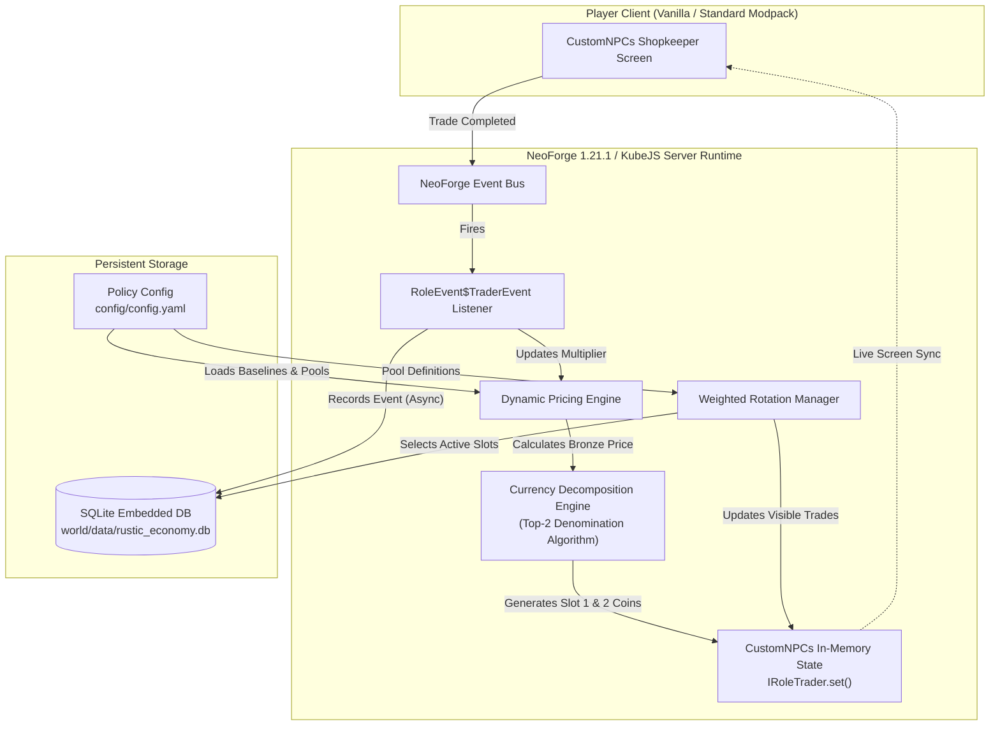
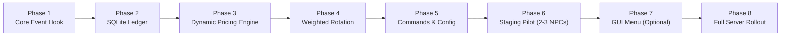

# Technical Architecture: Rustic Dynamic Economy

> **Status:** `PROPOSAL - AWAITING TEAM APPROVAL`  
> **Target Environment:** Rustic Craft 2 SMP (NeoForge 1.21.1 / Java 21) on `mc-staging-server`  
> **Frameworks:** KubeJS (Server & Client Events), CustomNPCs-Unofficial-NeoForge, SQLite 3  

---

## 1. Executive Summary & Problem Framing

An economic audit of Rustic Craft 2 SMP revealed that static, flat-rate shopkeeper NPC pricing is the single largest threat to economic fairness and server health. Flat pricing creates two destructive economic failure modes:
1. **Hyperinflation via Mass Supply:** Industrialized player farms produce bulk resources (iron, crops, mob drops) and dump them into NPCs at guaranteed static buyback prices, causing currency inflation.
2. **Economic Stagnation via Fixed Scarcity:** High-demand or rare items remain fixed in price, providing no economic signal or incentive for players to locate and bring them to market.

The **Rustic Dynamic Economy** replaces static shopkeeper prices with live, demand-driven pricing and weighted inventory rotation. The entire system is built **server-side only** using native NeoForge hooks in KubeJS, requiring zero client-side mods, zero external web services, and zero disruption to player immersion.



---

## 2. Core NeoForge & CustomNPCs Mechanics

The mechanics have been verified against the actual mod JARs installed on the staging server:

### 2.1 Event Interception: `RoleEvent$TraderEvent`
Every completed trade fires `noppes.npcs.api.event.RoleEvent$TraderEvent`.
- **Event Bus:** Standard NeoForge event bus hooked via KubeJS `NativeEvents.onEvent`.
- **Contract:** Implements `ICancellableEvent`. Exposes:
  - `event.npc`: The NPC entity executing the trade.
  - `event.player`: The player completing the trade.
  - `event.sold`: The `IItemStack` being purchased or sold.
  - `event.currency1`: Primary currency `IItemStack` exchanged.
  - `event.currency2`: Secondary currency `IItemStack` exchanged.

### 2.2 Live In-Memory Mutation: `IRoleTrader.set()`
Trade slots are updated live in memory:
```java
noppes.npcs.api.entity.data.role.IRoleTrader.set(int slot, IItemStack sold, IItemStack currency1, IItemStack currency2)
```
- **Access Pattern:** `event.npc.getRole()` cast to `IRoleTrader`.
- **No File Reload Required:** In-memory slot mutation takes effect immediately on the live server. It does **not** depend on CustomNPCs' separate "Linked NPC" file mechanism (which is reserved for manual one-off editor workflows).
- **Client Synchronization:** CustomNPCs automatically synchronizes container slot updates to interacting player container screens.

### 2.3 The Core Economic Invariant
> **CRITICAL ARCHITECTURAL INVARIANT:**  
> **Only the currency side of a trade fluctuates (`currency1` and `currency2`). The item being traded (`sold`) must NEVER be modified or scaled.**

- **Selling to NPC (Player Supply Influx):** When a player sells item $X$ to an NPC, the NPC pays **fewer coins** over time as supply accumulates. The item quantity in `sold` remains exactly 1 unit (or configured stack size).
- **Buying from NPC (Player Demand Pressure):** When a player buys item $Y$ from an NPC, the NPC charges **more coins** over time as demand rises. The quantity of item $Y$ offered remains identical.

---

## 3. Currency System & The 2-Slot Allocation Algorithm

### 3.1 The `adys_decorations` Coin System
Auditing the server confirms the currency mod is `adys_decorations`, featuring four coin tiers with an exact $64\times$ progression:
- **Bronze Coin:** Base unit (Value = $1$)
- **Brass Coin:** $64$ Bronze ($64\times$)
- **Silver Coin:** $64$ Brass = $4,096$ Bronze ($64^2$)
- **Gold Coin:** $64$ Silver = $262,144$ Bronze ($64^3$)

### 3.2 The Fundamental Constraint: 2 Slots vs 4 Denominations
`IRoleTrader.set()` provides only **two** currency item slots (`currency1` and `currency2`). Each slot can only hold a single `ItemStack` (one item type with maximum stack size 64).

An arbitrary price $P$ (in Bronze units) represents a base-64 number:
$$P = g \cdot 64^3 + s \cdot 64^2 + b \cdot 64^1 + z \cdot 64^0$$
where $g, s, b, z \in [0, 63]$.

Because $P$ can mathematically require up to 4 non-zero digits (e.g. $5,000 \text{ Bronze} = 1 \text{ Silver} + 14 \text{ Brass} + 8 \text{ Bronze}$), it is physical impossible in CustomNPCs to represent all 4 denominations simultaneously without dropping or rounding denominations.

### 3.3 The Proposed Solution: "Top-2 Canonical Denominations with Directional Rounding"
We reject hand-waving and propose the following deterministic algorithm:

1. **Calculate Internal Price:** All dynamic pricing, demand multiplier adjustments, and decay calculations are performed as 64-bit integer Bronze units.
2. **Decompose into Highest Denomination ($T_{\max}$):**
   Identify the highest coin tier $T_{\max}$ whose value is $\le P$.
   $$C_1 = \lfloor P / \text{Value}(T_{\max}) \rfloor$$
   $$\text{Remainder } R_1 = P \pmod{\text{Value}(T_{\max})}$$
3. **Assign Secondary Slot ($T_{\max - 1}$):**
   The second slot is dedicated to the immediately lower coin tier $T_{\max - 1}$.
   Any residual amount below $T_{\max - 1}$ is rounded into $T_{\max - 1}$:
   $$C_2 = \text{Round}\left( \frac{R_1}{\text{Value}(T_{\max - 1})} \right)$$
4. **Directional Rounding Rules (Anti-Exploit Protection):**
   - **Player Buying from NPC (NPC Sell):** Round **UP** (Ceiling). Prevents undercharging high-tier goods.
   - **Player Selling to NPC (NPC Buy):** Round **DOWN** (Floor). Prevents currency duplication exploits.
5. **Carry-Over Normalization:**
   If rounding causes $C_2 = 64$, increment $C_1 \leftarrow C_1 + 1$ and set $C_2 \leftarrow 0$.
6. **Slot Assignment:**
   - Slot 1: `ItemStack(T_max, C1)`
   - Slot 2: `C2 > 0 ? ItemStack(T_max - 1, C2) : null`

#### Precision & Error Analysis
- **Prices $< 4,096$ Bronze (Brass + Bronze):** Exactly fits in 2 slots ($b \cdot 64 + z$). **0% rounding error. 100% exact.**
- **Prices $4,096$ to $262,144$ Bronze (Silver + Brass):** Truncates loose Bronze. Maximum error is $\le 32$ Bronze ($< 0.78\%$ variance).
- **Prices $> 262,144$ Bronze (Gold + Silver):** Truncates loose Brass/Bronze. Maximum error is $\le 32$ Brass ($2,048$ Bronze, $< 0.78\%$ variance).

*Decision Status:* **PROPOSAL SUBMITTED FOR USER/TEAM CONFIRMATION**.

---

## 4. Dynamic Pricing Mathematical Model

### 4.1 Base Price and Bounds
Every trade catalog item defines an administrator baseline price $P_{\text{base}}$ (in Bronze).
The live price $P(t)$ is calculated as:
$$P(t) = \text{Round}\Big( P_{\text{base}} \times M(t) \Big)$$
where the multiplier $M(t)$ is bounded by:
$$M_{\min} \le M(t) \le M_{\max}$$
- **Default Floor:** $M_{\min} = 0.5$ ($-50\%$ maximum discount)
- **Default Ceiling:** $M_{\max} = 6.0$ ($+500\%$ maximum surge)
- Both bounds are configurable per item in `config/config.yaml`.

### 4.2 Trade Velocity & Multiplier Shift
When a trade occurs:
- **Player Purchase (Demand Increase):**
  $$M_{t+1} = \min\big( M_{\max}, M_t + \min(\Delta_{\max}, S \cdot Q) \big)$$
- **Player Sale (Supply Influx):**
  $$M_{t+1} = \max\big( M_{\min}, M_t - \min(\Delta_{\max}, S \cdot Q) \big)$$
where:
- $S$ is the **sensitivity coefficient** (default $0.05$).
- $Q$ is the quantity traded.
- $\Delta_{\max}$ is the **maximum single-trade jump cap** (default $0.25$), preventing a single whale trade from breaking market stability.

### 4.3 Baseline Time Decay
Prices drift back toward the $1.0\times$ baseline during periods of inactivity:
$$M_{t + \Delta t} = \begin{cases}
\max\big(1.0, M_t - \lambda \cdot \Delta t\big) & \text{if } M_t > 1.0 \\
\min\big(1.0, M_t + \lambda \cdot \Delta t\big) & \text{if } M_t < 1.0
\end{cases}$$
where $\lambda$ is the configured decay rate (default $0.02 / \text{hour}$).

---

## 5. SQLite Persistence & Concurrency Safety

### 5.1 Architecture & GriefLogger Precedent
The project adopts the embedded SQLite architecture already operational on the staging server for GriefLogger. SQLite provides zero-overhead local transactional storage without external database daemon dependencies.

### 5.2 Concurrency & Safety Protocol
> **MANDATORY SAFETY RULE:**  
> 1. **Live Server Writes Exclusively:** Only the active Minecraft server process (via KubeJS / server thread pool) is permitted to write to the SQLite database.
> 2. **External Queries Read-Only:** External processes, cron scripts, administrators, and AI tools may inspect the live database **only in read-only mode** (`PRAGMA query_only = ON;` or opening with read-only flags). Direct external writes to an active database file will corrupt WAL state and are strictly forbidden.

### 5.3 Schema Specification
Located at [`schema/001_init.sql`](file:///root/workspace/rustic-dynamic-economy/schema/001_init.sql):
- **`trade_events`:** Immutable chronological ledger of every trade (NPC ID, slot, item ID, buyer UUID/name, trade type, currency paid, normalized Bronze value, multiplier, timestamp).
- **`item_demand`:** Current dynamic pricing state per NPC and item (base price, current multiplier, rolling buy/sell volume, last trade timestamp, custom bounds).
- **`active_slots`:** Current visible slot allocation per NPC (NPC ID, slot index, item ID, count, is_wildcard flag). Ensures state survives restarts without re-randomizing.

---

## 6. Inventory Pool & Weighted Rotation

### 6.1 Thematic Scoping
NPCs have a trade pool larger than their visible trade slots ($N_{\text{pool}} > N_{\text{visible}}$).
- Pools are strictly per-NPC and thematically scoped (e.g. an agricultural NPC rotates wheat, carrots, and potatoes, but never diamond swords or machinery).

### 6.2 Demand-Weighted Sampling
When an inventory refresh triggers:
1. **Shared Economic Signal:** Items in high demand are both pricier and appear more frequently in shop slots.
   The probability $W_i$ of an item $i$ being selected into visible slots is proportional to its recent demand:
   $$W_i = \text{base\_weight}_i \times M_i$$
2. **Starvation Prevention:** Unselected items experience decay in their demand baseline so that bad timing never permanently starves an item from reappearing.
3. **Novelty Wildcard Slot:** At least **one slot per NPC** is reserved as a pure unweighted random wildcard from the pool, ensuring off-meta and rare items periodically appear regardless of historical demand.

---

## 7. Configuration & Administrative Interfaces

Administration is 100% in-game without external dashboards:

1. **YAML Policy File (`config/config.yaml`):**
   Parsed via SnakeYAML (bundled natively in the modpack via Kiwi and cloth-config). Admins configure baseline prices, bounds, sensitivity, decay, and NPC candidate pools in one clean file.
2. **Command Interface (`/dynprice`):**
   Built on KubeJS `CommandRegistryKubeEvent`:
   - `/dynprice view <npc> <item>`: Inspect current multiplier, rolling buy/sell volumes, and price.
   - `/dynprice setbound <npc> <item> <min> <max>`: Update bounds in real time.
   - `/dynprice refresh <npc>`: Trigger immediate weighted slot rotation.
   - `/dynprice reset <npc> [item]`: Reset multiplier back to $1.0\times$ base.
3. **AI Collaborative Loop:**
   Periodic offline analytical queries against `trade_events` generate proposed adjustments to `config/config.yaml`. AI **never** applies edits directly; all changes are submitted for human review.
4. **GUI Flow (Optional Phase 7):**
   Utilizes KubeJS `RegisterMenuScreensEvent` / `MenuScreenRegistryKubeEvent` to open an in-game container screen for live visual management.

---

## 8. Rollout Strategy & Phased Roadmap



### Safety Gating Rules:
1. **NPC Snapshot:** Full JSON/NBT export of target NPCs' trades before any script activation.
2. **Pilot Cohort:** Restricted to 2-3 pilot NPCs on `mc-staging-server` (e.g. Durand the Blacksmith and Garth the Provisioner).
3. **Staging Validation Gates:**
   - Live price mutation verified after player trade.
   - Boundary enforcement verified under simulated trade burst.
   - Slot state and multipliers survive full server restart without re-randomizing.
4. **Rollout Approval:** Promotion to general server NPCs requires explicit review of pilot telemetry.

---

## 9. Open Decisions Pending Team Confirmation

The following architectural choices are explicitly flagged for team signoff:
1. **Rotation Interval Trigger:** Should rotation occur strictly upon server restart, or periodically during active play (e.g., every 24,000 in-game ticks / Minecraft day)?
2. **Sensitivity and Decay Parameters:** Proposed defaults ($S = 0.05$, $\lambda = 0.02/\text{hr}$, $\Delta_{\max} = 0.25$) are ready for testing; final calibration will be refined with live staging pilot data.
3. **Currency Slot Allocation Proposal:** Team signoff on the "Top-2 Canonical Denominations with Directional Rounding" algorithm.
